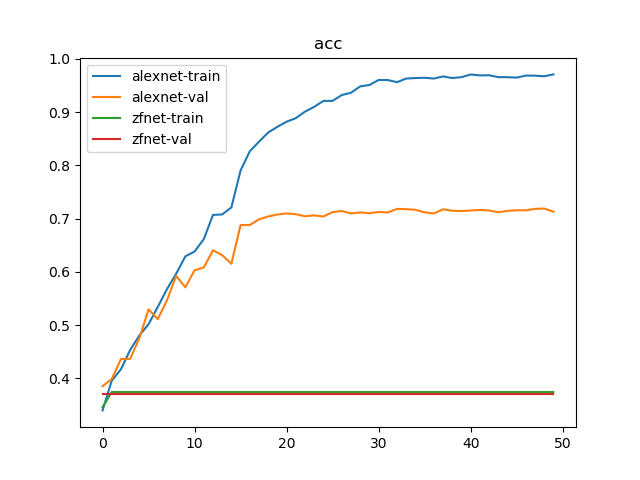
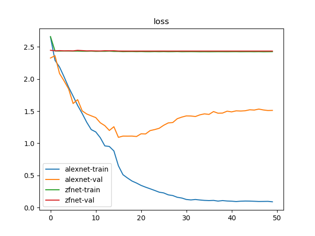

# 加载部分预训练模型

`PyTorch`提供了一些常用网络的预训练模型，比如`AlexNet`、`VGGNet`等等，参考[[译]保存和加载模型](./[译]保存和加载模型.md)

实际操作中经常会调整模型参数，所以只能加载部分的预训练模型

参考：

[PyTorch预训练](https://zhuanlan.zhihu.com/p/25980324)

[pytorch学习笔记之加载预训练模型](https://blog.csdn.net/weixin_41278720/article/details/80759933)

[How to load part of pre trained model?](https://discuss.pytorch.org/t/how-to-load-part-of-pre-trained-model/1113)

## 模型参数解析

模型参数以键值对的方式进行保存。以`AlexNet`为例，其模型定义如下：

```
class AlexNet(nn.Module):

    def __init__(self, num_classes=1000):
        super(AlexNet, self).__init__()
        self.features = nn.Sequential(
            nn.Conv2d(3, 64, kernel_size=11, stride=4, padding=2),
            nn.ReLU(inplace=True),
            nn.MaxPool2d(kernel_size=3, stride=2),
            nn.Conv2d(64, 192, kernel_size=5, padding=2),
            nn.ReLU(inplace=True),
            nn.MaxPool2d(kernel_size=3, stride=2),
            nn.Conv2d(192, 384, kernel_size=3, padding=1),
            nn.ReLU(inplace=True),
            nn.Conv2d(384, 256, kernel_size=3, padding=1),
            nn.ReLU(inplace=True),
            nn.Conv2d(256, 256, kernel_size=3, padding=1),
            nn.ReLU(inplace=True),
            nn.MaxPool2d(kernel_size=3, stride=2),
        )
        self.avgpool = nn.AdaptiveAvgPool2d((6, 6))
        self.classifier = nn.Sequential(
            nn.Dropout(),
            nn.Linear(256 * 6 * 6, 4096),
            nn.ReLU(inplace=True),
            nn.Dropout(),
            nn.Linear(4096, 4096),
            nn.ReLU(inplace=True),
            nn.Linear(4096, num_classes),
        )

    def forward(self, x):
        x = self.features(x)
        x = self.avgpool(x)
        x = torch.flatten(x, 1)
        x = self.classifier(x)
        return x
```

打印出模型参数的键以及值大小：

```
model = alexnet()
model_dict = model.state_dict()
for k, v in model_dict.items():
    print(k, v.shape)
############################ 输出
features.0.weight torch.Size([64, 3, 11, 11])
features.0.bias torch.Size([64])
features.3.weight torch.Size([192, 64, 5, 5])
features.3.bias torch.Size([192])
features.6.weight torch.Size([384, 192, 3, 3])
features.6.bias torch.Size([384])
features.8.weight torch.Size([256, 384, 3, 3])
features.8.bias torch.Size([256])
features.10.weight torch.Size([256, 256, 3, 3])
features.10.bias torch.Size([256])
classifier.1.weight torch.Size([4096, 9216])
classifier.1.bias torch.Size([4096])
classifier.4.weight torch.Size([4096, 4096])
classifier.4.bias torch.Size([4096])
classifier.6.weight torch.Size([1000, 4096])
classifier.6.bias torch.Size([1000])
```

## 加载模型

实际操作中，可分为`3`种加载场景

1. 仅修改输出大小
2. 修改部分层参数
3. 部分层一致

### 仅修改输出大小

最常遇见的就是修改输出类别，可以在加载完成后重新设置输出层即可

```
model = alexnet()
print(model)
num_features = model.classifier[6].in_features
model.classifier[6] = nn.Linear(num_features, 20)
print(model)
#################### 输出
AlexNet(
  (features): Sequential(
      。。。
      。。。
  )
  (avgpool): AdaptiveAvgPool2d(output_size=(6, 6))
  (classifier): Sequential(
      。。。
      。。。
    (6): Linear(in_features=4096, out_features=1000, bias=True)
  )
)
AlexNet(
  (features): Sequential(
      。。。
      。。。
  )
  (avgpool): AdaptiveAvgPool2d(output_size=(6, 6))
  (classifier): Sequential(
      。。。
      。。。
    (6): Linear(in_features=4096, out_features=20, bias=True)
  )
)
```

### 修改部分层参数

这里指的是未新增或者删除参数层，仅仅修改了参数层参数以及调整非参数层

以`ZFNet`为例，其修改了`AlexNet`的第一二个卷积层核大小，其定义如下：

```
class ZFNet(nn.Module):

    def __init__(self, num_classes=1000):
        super(ZFNet, self).__init__()
        self.features = nn.Sequential(
            nn.Conv2d(3, 64, kernel_size=7, stride=2, padding=2),
            nn.ReLU(inplace=True),
            nn.MaxPool2d(kernel_size=3, stride=2),
            nn.Conv2d(64, 192, kernel_size=5, stride=2, padding=2),
            nn.ReLU(inplace=True),
            nn.MaxPool2d(kernel_size=3, stride=2),
            nn.Conv2d(192, 384, kernel_size=3, padding=1),
            nn.ReLU(inplace=True),
            nn.Conv2d(384, 256, kernel_size=3, padding=1),
            nn.ReLU(inplace=True),
            nn.Conv2d(256, 256, kernel_size=3, padding=1),
            nn.ReLU(inplace=True),
            nn.MaxPool2d(kernel_size=3, stride=2),
        )
        self.avgpool = nn.AdaptiveAvgPool2d((6, 6))
        self.classifier = nn.Sequential(
            nn.Dropout(),
            nn.Linear(256 * 6 * 6, 4096),
            nn.ReLU(inplace=True),
            nn.Dropout(),
            nn.Linear(4096, 4096),
            nn.ReLU(inplace=True),
            nn.Linear(4096, num_classes),
        )

    def forward(self, x):
        x = self.features(x)
        x = self.avgpool(x)
        x = torch.flatten(x, 1)
        x = self.classifier(x)
        return x
```

此时`AlexNet`的键排列和`ZFNet`是一样的，逐个进行比对即可

```
def zfnet(num_classes=20):
    model = ZFNet(num_classes=num_classes)
    model_alexnet = alexnet(pretrained=True, progress=True)

    pretrained_dict = model_alexnet.state_dict()
    model_dict = model.state_dict()

    res_dict = dict()
    for item in zip(pretrained_dict.items(), model_dict.items()):
        pretrained_dict_item, model_dict_item = item

        k1, v1 = pretrained_dict_item
        k2, v2 = model_dict_item
        # print(v1.shape, v2.shape)

        # 处于相同层，判断大小是否一致
        if k1 == k2 and v1.shape == v2.shape:
            res_dict[k2] = v1
        else:
            res_dict[k2] = v2

    model_dict.update(res_dict)
    model.load_state_dict(model_dict)

    return model
```

### 部分层一致

如果新增或者删除或者打乱了原先模型的参数层顺序，只能**手动加入相同层的参数**了，或者可以按键进行查询

```
#加载model，model是自己定义好的模型
resnet50 = models.resnet50(pretrained=True) 
model =Net(...) 
 
#读取参数 
pretrained_dict =resnet50.state_dict() 
model_dict = model.state_dict() 
 
#将pretrained_dict里不属于model_dict的键剔除掉 
pretrained_dict =  {k: v for k, v in pretrained_dict.items() if k in model_dict} 
 
# 更新现有的model_dict 
model_dict.update(pretrained_dict) 
 
# 加载我们真正需要的state_dict 
model.load_state_dict(model_dict)  
```

## 示例

以`ZFNet`和`AlexNet`为例，参考[[PyTorch]ZFNet vs AlexNet](https://blog.zhujian.life/posts/d2cd3d94.html)，添加预训练模型后分类`VOC 2007`数据集

```
    for name in ['alexnet', 'zfnet']:
        if name == 'alexnet':
            model = torchvision.models.alexnet(pretrained=True, progress=True)
            num_features = model.classifier[6].in_features
            model.classifier[6] = nn.Linear(num_features, 20)
        else:
            # model = zfnet.ZFNet(num_classes=20)
            model = zfnet.zfnet(num_classes=20)
        。。。
        。。。
```

训练`50`轮结果如下：

```
{'train': 6301, 'val': 6307}
Epoch 0/49
----------
train Loss: 2.6524 Acc: 0.3398
val Loss: 2.3260 Acc: 0.3853
。。。
。。。
Epoch 49/49
----------
train Loss: 0.0905 Acc: 0.9708
val Loss: 1.5115 Acc: 0.7129

Training complete in 7m 4s
Best val Acc: 0.718884
train alexnet done

Epoch 0/49
----------
train Loss: 2.6594 Acc: 0.3457
val Loss: 2.4457 Acc: 0.3697
。。。
。。。
Epoch 49/49
----------
train Loss: 2.4244 Acc: 0.3742
val Loss: 2.4343 Acc: 0.3697

Training complete in 8m 53s
Best val Acc: 0.369748
train zfnet done
```





这是一个失败的参数加载，使用预训练模型后的`AlexNet`能够实现`71.88%`的验证集精度，而`ZFNet`只有`36.98%`，其原因在于`ZFNet`修改的是`AlexNet`的第一、二层卷积，而底层卷积层得到的初级特征最具有迁移作用