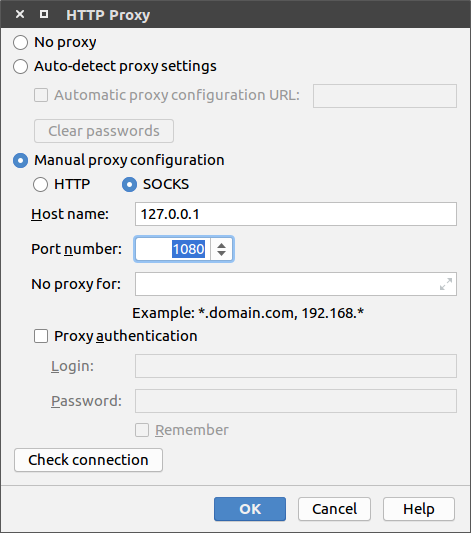

# [Ubuntu 16.04]Android Studio安装

## 系统配置

参考：[Linux](https://developer.android.com/studio#linux)

`Android Studio`要求`Linux`系统最低配置如下

* GNOME or KDE desktop. Tested on Ubuntu® 14.04 LTS, Trusty Tahr (64-bit distribution capable of running 32-bit applications)
* 64-bit distribution capable of running 32-bit applications
* GNU C Library (glibc) 2.19 or later
* 3 GB RAM minimum, 8 GB RAM recommended; plus 1 GB for the Android Emulator
* 2 GB of available disk space minimum, 4 GB Recommended (500 MB for IDE + 1.5 GB for Android SDK and emulator system image)
* 1280 x 800 minimum screen resolution

### 需不需要安装`JDK`

参考：

[Do I need Java JDK for using Android Studio?](https://stackoverflow.com/questions/42172010/do-i-need-java-jdk-for-using-android-studio)

[Set the JDK version](https://developer.android.com/studio/intro/studio-config.html#jdk)

安装`Android Studio`之前需不需要安装`JDK`

在`AS`官网的安装页面没有关于`JDK`的提示并且`AS`在内部集成了`JDK`

    A copy of the latest OpenJDK comes bundled with Android Studio 2.2 and higher, and this is the JDK version we recommend you use for your Android projects. To use the bundled JDK, proceed as follows:

## 下载

下载地址：[Android Studio](https://developer.android.com/studio)

## 安装

参考：[Linux](https://developer.android.com/studio/install#linux)

先安装依赖包

    $ sudo apt-get install libc6:i386 libncurses5:i386 libstdc++6:i386 lib32z1 libbz2-1.0:i386

下载得到`.zip`文件

1. 解压生成`android-studio`文件夹
2. 进入`android-sutdio/bin`目录
3. 执行`studio.sh`文件：`./studio.sh`
4. 按照提示设置

### 代理设置

问题描述：`Unable to access Android SDK add-on list`

我设置了`SSR`，所以选择`Setup Proxy->Manual proxy configuration`

选择`SOCKS`，`Host name`输入`127.0.0.1`，`Port number`输入`1080`

也可以参考[Unable to access Android SDK add-on list](https://stackoverflow.com/questions/28918069/unable-to-access-android-sdk-add-on-list/28958275)关闭代理设置

