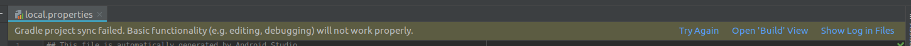
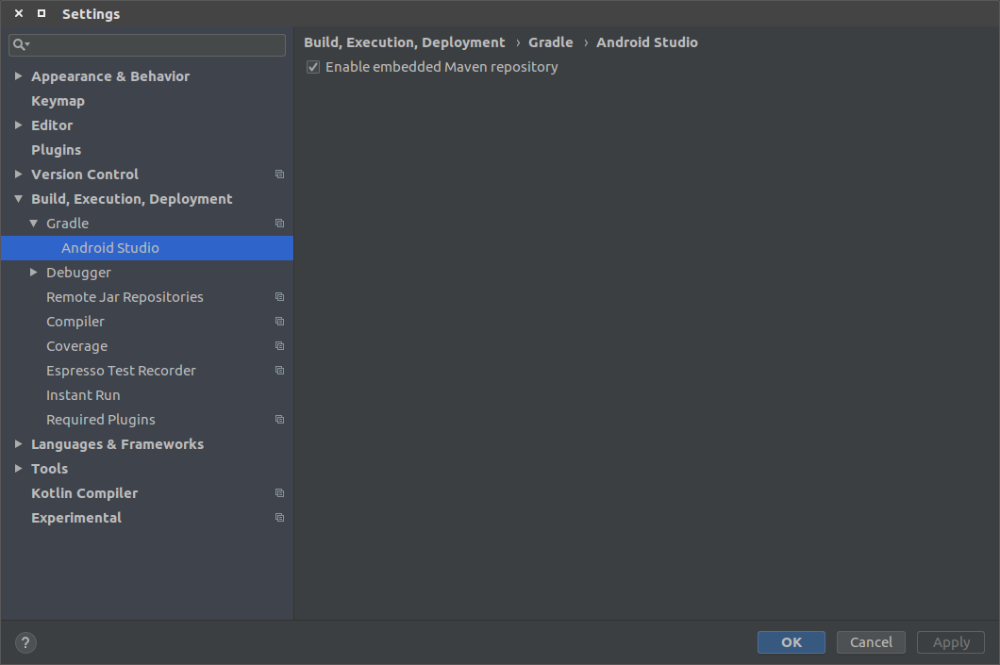

# [Ubuntu 16.04]gradle同步失败

## 问题一

下载`https://services.gradle.org/distributions/gradle-4.10.1-all.zip`失败

### 解决

`gradle`下载失败，所以重新下载并解压到指定路径下

查看当前未下载完全的`gradle-4.10.1-all.zip`

    $ locate gradle-4.10.1-all.zip
    /home/zj/.gradle/wrapper/dists/gradle-4.10.1-all/455itskqi2qtf0v2sja68alqd/gradle-4.10.1-all.zip
    /home/zj/.gradle/wrapper/dists/gradle-4.10.1-all/455itskqi2qtf0v2sja68alqd/gradle-4.10.1-all.zip.lck
    /home/zj/.gradle/wrapper/dists/gradle-4.10.1-all/455itskqi2qtf0v2sja68alqd/gradle-4.10.1-all.zip.ok

进入`455itskqi2qtf0v2sja68alqd`文件夹，删除所有文件

    $ ls
    gradle-4.10.1  gradle-4.10.1-all.zip  gradle-4.10.1-all.zip.lck  gradle-4.10.1-all.zip.ok
    $ rm -rf *

下载`gradle-4.10.1-all.zip`

    $ wget https://services.gradle.org/distributions/gradle-4.10.1-all.zip

放置到`~/.gradle/wrapper/dists/gradle-4.10.1-all/455itskqi2qtf0v2sja68alqd/`路径下并解压

重新构建工程即可

## 问题二

    org.gradle.api.resources.ResourceException: Could not get resource 'https://dl.google.com/dl/android/maven2/com/android/tools/build/gradle/3.3.1/gradle-3.3.1.pom'

参考：[gradle/3.1.0/gradle-3.1.0.pom](https://discuss.gradle.org/t/android-studio-could-not-get-resource-https-dl-google-com-dl-android-maven2-com-android-tools-build-gradle-3-1-0-gradle-3-1-0-pom/26734)

进入`AS`系统设置`->Build,Execution,Deployment->Gradle->Android Studio`，启动`Enable embedded Maven repository`

## 问题三

    ERROR: Unable to resolve dependency for ':app@debug/compileClasspath': Could not resolve com.android.support:appcompat-v7:28.0.0.
    Affected Modules: app

找了很久，终于找到一个参考：[android studio 3.1.4 踩神坑（mac版本）(Unable to resolve dependency for ':xxx compileClasspath)](https://blog.csdn.net/lckj686/article/details/82751331)

我是设置了全局代理，全局`gradle.properties`在`~/.gradle`路径下，注释掉代理

    #systemProp.https.proxyPort=1080
    #systemProp.http.proxyHost=127.0.0.1
    #systemProp.https.proxyHost=127.0.0.1
    #systemProp.http.proxyPort=1080

重新构建即可

