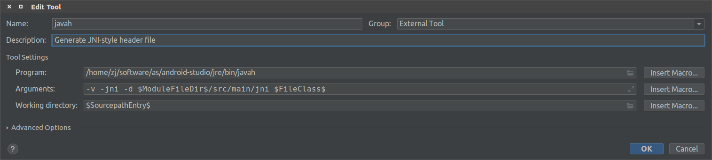
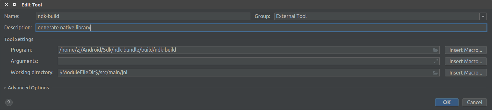

# [Ubuntu 16.04]android studio配置javah和ndk-build

参考：[android ndk 入门 - 一个简单的ndk工程](https://blog.csdn.net/u012005313/article/details/49911693)

在`Android Studio`上配置`javah`和`ndk-build`，实现简单的`ndk`工程

## 配置`NDK`包

首先下载`NDK`包，点击菜单栏`Tools->SDM Manager`，选择`SDK Tools`，下载`NDK`

下载完成后可以查看`local.properties`，里面有下载的路径

    ndk.dir=/home/zj/Android/Sdk/ndk-bundle

也可以手动下载，然后再`local.properties`上添加路径

## 设置`javah`

命令`javah`用于生成`JNI`类型的头文件，已内置在`android studio`安装包中

    $ $ locate javah
    /home/zj/software/as/android-studio/jre/bin/javah

点击菜单栏`File->Settings->Tools->External Tools`，点击右侧的加号图标

添加`Name、Description`，指定`Program、Arguments、Working directory`

* `Program: /home/zj/software/as/android-studio/jre/bin/javah`
* `Argument: -v -jni -d $ModuleFileDir$/src/main/jni $FileClass$`
* `Working directory: $SourcepathEntry$`

参数`-v`表示详细输出
参数`-jni`表示生成`JNI`类型的头文件
参数`-d`表示输出目录

宏定义`ModuleFileDir`表示模块路径
宏定义`FileClass`表示类名
宏定义`SourcepathEntry`表示元素路径

设置完成后，编写测试`Java`类`HelloJni.java`，加载本地库`helloJNI`，声明本地函数`stringFromJNI`

    public class HelloJni {

        static {
            System.loadLibrary("helloJNI");
        }

        public static native String stringFromJNI();

    }

鼠标点击`HelloJni.java`，右键`->External Tool->javah`

    /home/zj/software/as/android-studio/jre/bin/javah -v -jni -d /home/zj/AndroidStudioProjects/MyApplication/app/src/main/jni com.example.myapplication.HelloJNI
    [Creating file RegularFileObject[/home/zj/AndroidStudioProjects/MyApplication/app/src/main/jni/com_example_myapplication_HelloJNI.h]]

就可以在`src/main/jni/`路径下生成头文件`com_example_myapplication_HelloJNI.h`

    /* DO NOT EDIT THIS FILE - it is machine generated */
    #include <jni.h>
    /* Header for class com_example_myapplication_HelloJNI */

    #ifndef _Included_com_example_myapplication_HelloJNI
    #define _Included_com_example_myapplication_HelloJNI
    #ifdef __cplusplus
    extern "C" {
    #endif
    /*
    * Class:     com_example_myapplication_HelloJNI
    * Method:    stringFromJNI
    * Signature: ()Ljava/lang/String;
    */
    JNIEXPORT jstring JNICALL Java_com_example_myapplication_HelloJNI_stringFromJNI
    (JNIEnv *, jclass);

    #ifdef __cplusplus
    }
    #endif
    #endif

### 编译出错

之前配置好后都可以成功运行,但是今天点击`.java`文件,右键`->External Tool->javah`失败

    /home/zj/software/java/jdk1.8.0_201/bin/javah -v -jni -d /home/zj/Documents/PICC/android/faceocr/src/main/jni com.zj.faceocr.FaceOCR
    Error: Could not find class file for 'com.zj.faceocr.FaceOCR'.

母鸡,在网上找了一个参考:[Javah tool error: Could not find class file for hellojni](https://stackoverflow.com/questions/19137201/javah-tool-error-could-not-find-class-file-for-hellojni)

在包文件根目录下进行`javah`操作才能够成功

    $ javah -v -jni -d /home/zj/Documents/PICC/android/faceocr/src/main/jni com.zj.faceocr.FaceOCR
    [Creating file RegularFileObject[/home/zj/Documents/PICC/android/faceocr/src/main/jni/com_zj_faceocr_FaceOCR.h]]

参考:[android studio external tool 自定义工具（Javah命令）](https://blog.csdn.net/fangyoayu2013/article/details/51094061)

增加参数`-classpath`

    -classpath . -v -jni -d $ModuleFileDir$/src/main/jni $FileClass$

## 配置`ndk-build`

`nkd-build`命令在刚才配置的`ndk-bundle`包中

    $ locate ndk-build
    /home/zj/Android/Sdk/ndk-bundle/ndk-build

其配置方式和`javah`一样，点击菜单栏`File->Settings->Tools->External Tools`，点击右侧的加号图标

添加`Name、Description`，指定`Program、Working directory（ndk-build不需要参数）`

* `Program: /home/zj/Android/Sdk/ndk-bundle/build/ndk-build`
* `Working directory: $ModuleFileDir$/src/main/jni`

宏定义`ModuleFileDir`表示模块路径

在`jni`包中新建文件`main.cpp`

    #include <string.h>
    #include <jni.h>
    #include "com_example_myapplication_HelloJNI.h"

    extern "C" {

    JNIEXPORT jstring JNICALL Java_com_example_myapplication_HelloJNI_stringFromJNI
    (JNIEnv *env, jclass cls)
    {
        return env->NewStringUTF("Hello from JNI !");
    }

    }

声明了刚才生成的头文件，同时实现了声明的函数

新建配置文件`Android.mk`，最简单的配置如下，参考：[Android.mk](https://developer.android.com/ndk/guides/android_mk)

    # 指示源文件在开发树中的位置，宏定义my-dir表示当前路径
    LOCAL_PATH := ${call my-dir}
    # 清除之前声明的变量值
    include $(CLEAR_VARS)
    # 模块名，不包含空格
    LOCAL_MODULE := helloJNI
    # 待编译的源文件
    LOCAL_SRC_FILES := main.cpp
    # 收集之前定义的本地变量，用于生成共享库
    include $(BUILD_SHARED_LIBRARY)

鼠标点击`jni`文件夹，右键`->External Tools->ndk-build`，生成的库在`src/main/libs`包内（`libs`和`jni`在同一路径下）

    /home/zj/Android/Sdk/ndk-bundle/build/ndk-build
    Android NDK: APP_PLATFORM not set. Defaulting to minimum supported version android-16.    
    Android NDK: WARNING: APP_PLATFORM android-16 is higher than android:minSdkVersion 1 in /home/zj/AndroidStudioProjects/MyApplication/app/src/main/AndroidManifest.xml. NDK binaries will *not* be compatible with devices older than android-16. See https://android.googlesource.com/platform/ndk/+/master/docs/user/common_problems.md for more information.    
    [arm64-v8a] Compile++      : helloJNI <= main.cpp
    [arm64-v8a] StaticLibrary  : libstdc++.a
    [arm64-v8a] SharedLibrary  : libhelloJNI.so
    [arm64-v8a] Install        : libhelloJNI.so => libs/arm64-v8a/libhelloJNI.so
    [armeabi-v7a] Compile++ thumb: helloJNI <= main.cpp
    [armeabi-v7a] StaticLibrary  : libstdc++.a
    [armeabi-v7a] SharedLibrary  : libhelloJNI.so
    [armeabi-v7a] Install        : libhelloJNI.so => libs/armeabi-v7a/libhelloJNI.so
    [x86] Compile++      : helloJNI <= main.cpp
    [x86] StaticLibrary  : libstdc++.a
    [x86] SharedLibrary  : libhelloJNI.so
    [x86] Install        : libhelloJNI.so => libs/x86/libhelloJNI.so
    [x86_64] Compile++      : helloJNI <= main.cpp
    [x86_64] StaticLibrary  : libstdc++.a
    [x86_64] SharedLibrary  : libhelloJNI.so
    [x86_64] Install        : libhelloJNI.so => libs/x86_64/libhelloJNI.so

## 构建

还需要在模块`build.gradle`上配置库路径，添加

    android {
        ...
        ...
        sourceSets {
            main() {
                jniLibs.srcDirs = ['src/main/libs']
                jni.srcDirs = []
            }
        }
    }

这样就可以调用本地函数`stringFromJNI`了，返回一个字符串

    HelloJni.stringFromJNI();