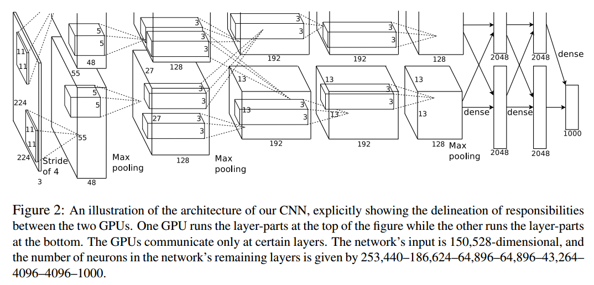
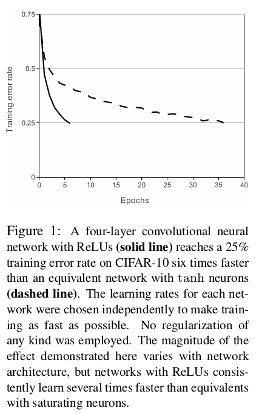
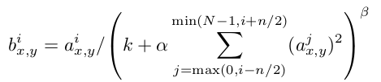

# AlexNet

参考：[Understanding AlexNet](https://www.learnopencv.com/understanding-alexnet/)

## 网络结构

`AlexNet`由`5`个卷积层和`3`个全连接层组成，卷积层和全连接层都使用`ReLU`作为激活函数

前两个卷积层后跟随一个`overlapping pool`(重叠池化)层和一个局部归一化层，第三、第四和第五个卷积层直接连接

在前两个全连接层中使用局部激活函数

在文章[ImageNet Classification with Deep Convolutional Neural Networks](http://xueshu.baidu.com/usercenter/paper/show?paperid=bfdf67dfdf8cea0c47038f63e91b9df1&site=xueshu_se)中，AlexNet使用双GPU进行训练，其结构如下所示：

在每个`GPU`中执行每层一半的卷积层滤波器，全连接层同样连接全部的前一层神经元

单`GPU`训练的`AlexNet`模型如下：

* `INPUT`：`227x227`大小`3`通道彩色图像
* `1-CONV`：卷积核大小`11x11`，深度`3`，步长`4`，滤波器个数`96`
* `POOL`：滤波器大小`3x3`，步长`2`
* `2-CONV`：卷积核大小`5x5`，深度`96`，零填充`2`，滤波器个数`256`
* `POOL`：滤波器大小`3x3`，步长`2`
* `3-CONV`：卷积核大小`3x3`，深度`256`，零填充`1`，滤波器个数`384`
* `4-CONV`：卷积核大小`3x3`，深度`384`，零填充`1`，滤波器个数`384`
* `5-CONV`：卷积核大小`3x3`，深度`384`，零填充`1`，滤波器个数`384`
* `POOL`：滤波器大小`3x3`，步长`2`
* `1-FC`：`4096`
* `2-FC`：`4096`
* `3-OUTPUT`：`1000`

### `224`还是`227`

在原文中作者输入图像大小为`224x224`，不过经过推算不符合网络计算，应该使用`227x227`作为输入图像大小

## 神经元和参数个数

参考：

[AlexNet中的参数数量](https://vimsky.com/article/3664.html)

[How to calculate the number of parameters of AlexNet?](https://stackoverflow.com/questions/40060949/how-to-calculate-the-number-of-parameters-of-alexnet)

整个网络约有`6`千万个参数和`65`万个神经元，计算如下：

输入层大小`227x227x3`，输入维数是`15,4587`

第一层卷积层卷积核大小为`11x11x3`，步长`4`，滤波器个数`96`，所以参数个数是`(11x11x3)x96+96=3,4944`，输出大小为`55x55x96=29,0400`

池化层滤波器大小为`3x3`，步长`2`，所以输出大小为`27x27x96`

第二层卷积层卷积核大小为`5x5x96`，零填充`2`，滤波器个数`256`，所以参数个数是`(5x5x96)x256+256=61,4656`，输出大小为`27x27x256=18,6624`

池化层滤波器大小为`3x3`，步长`2`，所以输出大小为`13x13x256`

第三层卷积层卷积核大小为`3x3x256`，零填充`1`，滤波器个数是`384`个，所以参数个数是`(3x3x256)x384+384=88,5120`，输出大小为`13x13x384=6,4896`

第四层卷积层卷积核大小为`3x3x384`，零填充`1`，滤波器个数是`384`个，所以参数个数是`(3x3x384)x384+384=132,7488`，输出大小为`13x13x384=6,4896`

第五层卷积层卷积核大小为`3x3x384`，零填充`1`，滤波器个数是`256`，所以参数个数是`(3x3x384)x256+256=88,4992`，输出大小为`13x13x256=4,3264`

池化层滤波器大小为`3x3`，步长`2`，所以输出大小为`6x6x256`

第一层全连接层大小为`4096`，所以参数个数是`(6x6x256)x4096+4096=3775,2832`，输出大小为`4096`

第二层全连接层大小为`4096`，所以参数个数是`4096x4096+4096=1678,1312`，输出大小为`4096`

输出层大小为`1000`，所以参数个数是`4096x1000+1000=409,7000`

神经元总个数是`15,4587+29,0400+18,6624+6,4896+6,4896+4,3264+4096+4096+1000=81,3859`（不包括输入层就是`65,9272`）

参数总个数是`3,4944+61,4656+88,5120+132,7488+88,4992+3775,2832+1678,1312+409,7000=6237,8344`

## 特性

主要有五点：

1. 使用`ReLU`作为激活函数提高泛化能力
2. 使用局部响应归一化(`LRN`)方法增加泛化能力
3. 使用`Overlapping Pool`作为池化层提高泛化能力
4. 使用`Dropout`减少过拟合
5. 通过数据扩充（`data augmentation`）减少过拟合

### `ReLU`

之前标准的激活函数是`tanh()`和`sigmoid()`函数，文章中使用`ReLU(Rectified Linear Units，修正线性单元)`作为神经元激活函数

使用4层卷积神经网络训练`CIFAR-10`数据集，比较达到`25%`训练误差率的时间，使用`ReLU`能够比`tanh`快`6`倍

### `LRN`

参考：[深度学习: 局部响应归一化 (Local Response Normalization，LRN)](https://cloud.tencent.com/developer/article/1347792)

数学实现如下：

经过`ReLU`激活后的卷积图，第i层上的位置为`(x,y)`的神经元值`a`，需要除以其相邻`n`个层相同位置的神经元值之和。常量k，n，$\alpha$，$\beta$都是超参数，需要通过验证集设定，当前设定为k=2，n=5，$\alpha$=10^-4，$beta$=0.75

其目的是实现神经元的侧抑制（`lateral inhibition`），在不同层之间进行竞争，使响应值大的神经元变得更大，并抑制其他较小的神经元

`LRN（Local Response Normalization，局部响应归一化）`能够提高泛化能力：在`ImageNet 1000`类分类任务中，`LRN`减少了`1.4% top-1`和`1.2% top5`的错误率；在`cifar-10`数据集测试中，一个`4`层神经网络能达到`13%`测试误差率（没有`LRN`）和`11%`测试误差率（有`LRN`）

### `Overlapping Pool`

传统的池化层步长和滤波器大小相同（`s=z=2`），所以滤波器操作不会重叠

`alexnet`使用重叠池化（`Overlapping Pool`）操作，步长小于滤波器大小（`s=2,x=3,s<z`），这在`1000`类分类任务上能够实现`0.4% top-1`和`0.3% top-5`的提高

### `Dropout`

集合不同网络模型进行预测能够很好的减少测试误差，但是对于大网络而言需要耗费很多时间进行训练。随机失活（`dropout`）操作对中间隐含层进行操作，以`0.5`的概率判断该神经元是否失效，即这个神经元不进行前向操作，也不进行反向更新

有两点优势：

1. 每次进行训练都是在不同的网络架构上，与此同时这些不同的网络架构共享同一套权重
2. 减少神经元复杂的共适应性（`co-adaptation`），神经元不能依赖于某个特定的神经元

在测试阶段，对所有神经元的输出都乘以`0.5`，以获取指数多个`dropout`网络产生的预测分布的几何平均值

在`alexnet`模型中，对前两个全连接层进行`dropout`操作。如果没有`dropout`，整个网络会严重过拟合，并且训练过程达到收敛的时间大致增加了一倍

### 数据扩充

文章中提高了两种方式

1. 提取数据集
2. 预训练数据集

首先获取`256x256`大小的数据集，在从中随机获取`227x227`大小的训练图像，同时通过水平映像(`horizontal reflection`)等操作来扩大数据集

其次是改变训练数据的通道强度，对于每个`RGB`图像像素$I_{xy}=[I_{xy}^{B},I_{xy}^{G},I_{xy}^{B}]^{T}$，添加如下值：

其中$p_{i}$是第i个特征向量（eigenvector），$\lambda_{i}$是RGB像素值3x3协方差矩阵（covariance matrix）的特征值，$\alpha_{i}$是符合零均值(`mean zero`)和`0.1`标准方差(`standard deviation`)的服从高斯分布的随机变量，特定训练图像上的每个像素使用的$\alpha_{i}$都不相同，再次训练时需要重新设置$\alpha_{i}$

使用`PCA`改变图像强度的理论基础是自然图像的一个重要特性：物体同一性不随照明强度和颜色的变化而变化

这种方法减少了至少`1% top-1`误差率