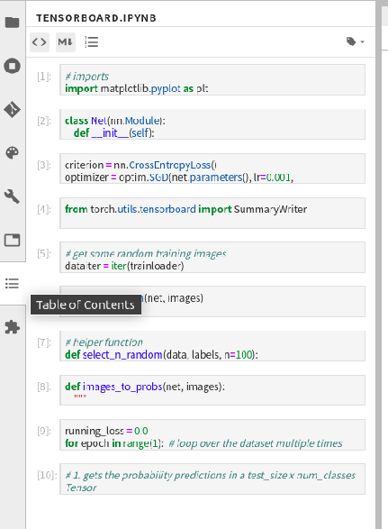

# 目录生成插件

参考：[提升 Jupyter Notebook 使用体验的五个隐藏功能](https://www.jianshu.com/p/bc72f8cfe0a3)

点击右侧侧边栏的插件管理器图标，查询[toc](https://github.com/jupyterlab/jupyterlab-toc)插件并安装

安装完成后在右侧侧边栏会出现`Table of Contents`图标

在目录列表中会显示每个`cell`，点击即可快速跳转