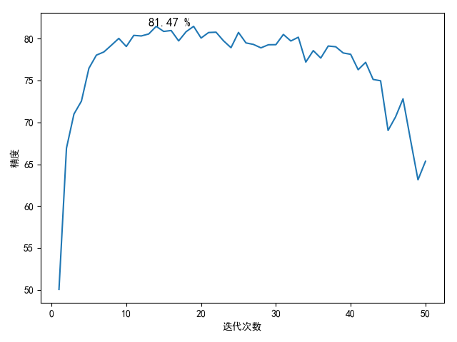

# AlexNet定义

`AlexNet`使用`5`层卷积层和`3`层全连接层

`pytorch`已经定义好了[AlexNet模型](https://github.com/pytorch/vision/blob/master/torchvision/models/alexnet.py)

```
import torchvision.models as models
alexnet = models.alexnet()
```

其实现和原文有差别

```
AlexNet(
  (features): Sequential(
    (0): Conv2d(3, 64, kernel_size=(11, 11), stride=(4, 4), padding=(2, 2))
    (1): ReLU(inplace)
    (2): MaxPool2d(kernel_size=3, stride=2, padding=0, dilation=1, ceil_mode=False)
    (3): Conv2d(64, 192, kernel_size=(5, 5), stride=(1, 1), padding=(2, 2))
    (4): ReLU(inplace)
    (5): MaxPool2d(kernel_size=3, stride=2, padding=0, dilation=1, ceil_mode=False)
    (6): Conv2d(192, 384, kernel_size=(3, 3), stride=(1, 1), padding=(1, 1))
    (7): ReLU(inplace)
    (8): Conv2d(384, 256, kernel_size=(3, 3), stride=(1, 1), padding=(1, 1))
    (9): ReLU(inplace)
    (10): Conv2d(256, 256, kernel_size=(3, 3), stride=(1, 1), padding=(1, 1))
    (11): ReLU(inplace)
    (12): MaxPool2d(kernel_size=3, stride=2, padding=0, dilation=1, ceil_mode=False)
  )
  (classifier): Sequential(
    (0): Dropout(p=0.5)
    (1): Linear(in_features=9216, out_features=4096, bias=True)
    (2): ReLU(inplace)
    (3): Dropout(p=0.5)
    (4): Linear(in_features=4096, out_features=4096, bias=True)
    (5): ReLU(inplace)
    (6): Linear(in_features=4096, out_features=1000, bias=True)
  )
)
```

原文实现如下：

```
import torch.nn as nn

__all__ = ['AlexNet', 'alexnet']


class AlexNet(nn.Module):

    def __init__(self, num_classes=1000):
        super(AlexNet, self).__init__()
        self.conv1 = nn.Sequential(
            nn.Conv2d(3, 96, kernel_size=11, stride=4),
            nn.ReLU(inplace=True),
            nn.MaxPool2d(kernel_size=3, stride=2)
        )
        self.conv2 = nn.Sequential(
            nn.Conv2d(96, 256, kernel_size=5, padding=2),
            nn.ReLU(inplace=True),
            nn.MaxPool2d(kernel_size=3, stride=2)
        )
        self.conv3 = nn.Sequential(
            nn.Conv2d(256, 384, kernel_size=3, padding=1),
            nn.ReLU(inplace=True)
        )
        self.conv4 = nn.Sequential(
            nn.Conv2d(384, 384, kernel_size=3, padding=1),
            nn.ReLU(inplace=True)
        )
        self.conv5 = nn.Sequential(
            nn.Conv2d(384, 256, kernel_size=3, padding=1),
            nn.ReLU(inplace=True),
            nn.MaxPool2d(kernel_size=3, stride=2)
        )
        self.dense = nn.Sequential(
            nn.Dropout(),
            nn.Linear(6 * 6 * 256, 4096),
            nn.ReLU(inplace=True),
            nn.Dropout(),
            nn.Linear(4096, 4096),
            nn.ReLU(inplace=True),
            nn.Linear(4096, num_classes),
        )

    def forward(self, x):
        x = self.conv1(x)
        x = self.conv2(x)
        x = self.conv3(x)
        x = self.conv4(x)
        x = self.conv5(x)
        x = x.view(x.size(0), 256 * 6 * 6)
        x = self.dense(x)
        return x


def alexnet(**kwargs):
    model = AlexNet(**kwargs)
    return model


if __name__ == '__main__':
    net = alexnet()
    print(net)
```

网络结构如下：

```
AlexNet(
  (conv1): Sequential(
    (0): Conv2d(3, 96, kernel_size=(11, 11), stride=(4, 4))
    (1): ReLU(inplace)
    (2): MaxPool2d(kernel_size=3, stride=2, padding=0, dilation=1, ceil_mode=False)
  )
  (conv2): Sequential(
    (0): Conv2d(96, 256, kernel_size=(5, 5), stride=(1, 1), padding=(2, 2))
    (1): ReLU(inplace)
    (2): MaxPool2d(kernel_size=3, stride=2, padding=0, dilation=1, ceil_mode=False)
  )
  (conv3): Sequential(
    (0): Conv2d(256, 384, kernel_size=(3, 3), stride=(1, 1), padding=(1, 1))
    (1): ReLU(inplace)
  )
  (conv4): Sequential(
    (0): Conv2d(384, 384, kernel_size=(3, 3), stride=(1, 1), padding=(1, 1))
    (1): ReLU(inplace)
  )
  (conv5): Sequential(
    (0): Conv2d(384, 256, kernel_size=(3, 3), stride=(1, 1), padding=(1, 1))
    (1): ReLU(inplace)
    (2): MaxPool2d(kernel_size=3, stride=2, padding=0, dilation=1, ceil_mode=False)
  )
  (dense): Sequential(
    (0): Dropout(p=0.5)
    (1): Linear(in_features=9216, out_features=4096, bias=True)
    (2): ReLU(inplace)
    (3): Dropout(p=0.5)
    (4): Linear(in_features=4096, out_features=4096, bias=True)
    (5): ReLU(inplace)
    (6): Linear(in_features=4096, out_features=1000, bias=True)
  )
)
```

使用`cifar-10`进行测试，使用`SGD`进行反向更新，每次批量训练`4`张图像，学习率为`0.01`，`momentum`为`0.9`

`50`次训练精度如下：

```
# -*- coding: utf-8 -*-


import matplotlib.pyplot as plt

accuracy_list = [50.06, 66.92, 70.99, 72.54, 76.46, 78.03, 78.41, 79.21, 80.03, 79.06, 80.39, 80.32, 80.56, 81.47,
                 80.86, 80.97, 79.73, 80.83, 81.47, 80.07, 80.73, 80.77, 79.74, 78.92, 80.74, 79.49, 79.31, 78.9, 79.27,
                 79.28, 80.5, 79.72, 80.17, 77.2, 78.57, 77.68, 79.12, 79.03, 78.29, 78.13, 76.29, 77.17, 75.13, 74.97,
                 69.04, 70.65, 72.81, 67.92, 63.14, 65.35]

if __name__ == '__main__':
    max_accuracy = max(accuracy_list)
    index = accuracy_list.index(max_accuracy)
    print(max_accuracy)
    print(index)

    x = list(range(1, 51))
    y = accuracy_list

    fig = plt.figure(1)
    plt.xlabel('迭代次数')
    plt.ylabel('精度')
    plt.plot(x, y)
    plt.text(index, max_accuracy, '%.2f %%' % (max_accuracy), fontsize=12)

    plt.show()
```

