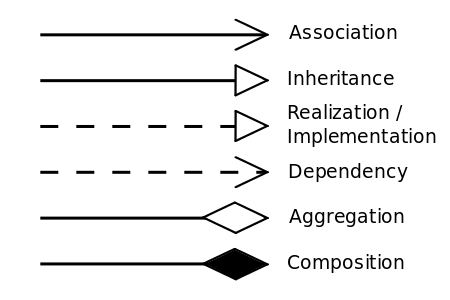
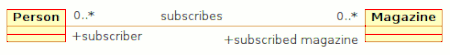
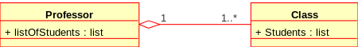
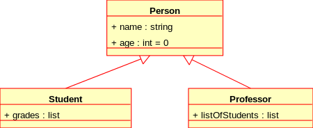
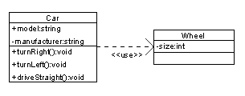
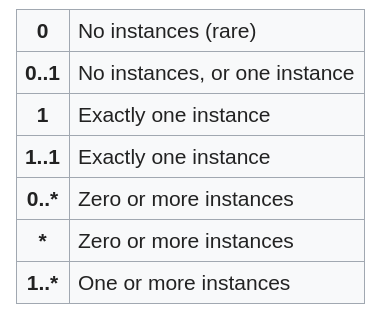

# [译][wiki]Class-Diagram

学习UML类图的基本概念，在wiki上发现了比较详细的介绍，内容不多但是很精炼，所以翻译一下，以便后续的学习

原文地址：[Class diagram](https://en.wikipedia.org/wiki/Class_diagram)

## 引言

>In software engineering, a class diagram in the Unified Modeling Language (UML) is a type of static structure diagram that describes the structure of a system by showing the system's classes, their attributes, operations (or methods), and the relationships among objects.

在软件工程中，统一建模语言(UML)中的类图是一种静态结构图，它通过显示系统的类、它们的属性、操作(或方法)以及对象之间的关系来描述系统的结构

>The class diagram is the main building block of object-oriented modeling. It is used for general conceptual modeling of the structure of the application, and for detailed modeling translating the models into programming code. Class diagrams can also be used for data modeling.[1] The classes in a class diagram represent both the main elements, interactions in the application, and the classes to be programmed.

类图是面向对象建模的主要构件。它用于应用程序结构的一般概念建模，以及将模型转换为编程代码的详细建模。类图也可以用于数据建模[1]。类图中的类代表了应用程序中的主要元素、交互以及要编程的类

>In the diagram, classes are represented with boxes that contain three compartments:
>* The top compartment contains the name of the class. It is printed in bold and centered, and the first letter is capitalized.
>* The middle compartment contains the attributes of the class. They are left-aligned and the first letter is lowercase.
>* The bottom compartment contains the operations the class can execute. They are also left-aligned and the first letter is lowercase.

在图中，类用包含三个部分的框来表示:

* 顶部包含类的名称。它以粗体和居中打印，第一个字母大写
* 中间部分包含类的属性。它们是左对齐的，第一个字母是小写的
* 底部包含类可执行的操作。它们也是左对齐的，第一个字母是小写的

>*A class with three compartments.*

*图１：包含三个部分的类*

>In the design of a system, a number of classes are identified and grouped together in a class diagram that helps to determine the static relations between them. With detailed modeling, the classes of the conceptual design are often split into a number of subclasses.

在系统设计中，许多类被标识并组合在一个类图中，这有助于确定它们之间的静态关系。通过详细的建模，概念设计的类通常被分成许多子类

>In order to further describe the behaviour of systems, these class diagrams can be complemented by a state diagram or UML state machine.[2]

为了进一步描述系统的行为，这些类图可以用状态图或UML状态机来补充[2]

## 内容列表

    1.	Members
        1.1	Visibility
        1.2	Scope
    2.	Relationships
        2.1	Instance-level relationships
            2.1.1	Dependency（依赖）
            2.1.2	Association（关联）
            2.1.3	Aggregation（聚合）
            2.1.4	Composition（组合/组成）
            2.1.5	Differences between Composition and Aggregation
        2.2	Class-level relationships
            2.2.1	Generalization/Inheritance（泛化/继承）
            2.2.2	Realization/Implementation（实现/继承）
        2.3	General relationship
            2.3.1	Dependency
        2.4	Multiplicity
    3.	Analysis stereotypes
        3.1	Entities
    4.	See also
    5.	References
    6.	External links

## Members

成员

>UML provides mechanisms to represent class members, such as attributes and methods, and additional information about them like constructors.

UML提供了表示类成员的机制，比如属性和方法，以及关于它们的附加信息，比如构造函数

### Visibility

可见性

>To specify the visibility of a class member (i.e. any attribute or method), these notations must be placed before the member's name:[3]
>
    +	Public
    -	Private
    #	Protected
    ~	Package

要指定类成员的可见性(即任何属性或方法)，这些符号必须放在成员名称之前:[3]
 
    +	公共
    -	私有
    #	受保护
    ~	包

>Derived property is a property which value (or values) is produced or computed from other information, for example, by using values of other properties.

派生属性是一种属性，其值(或多个值)是根据其他信息生成或计算的，例如，通过使用其他属性的值

>Derived property is shown with its name preceded by a forward slash '/'. [4]

派生属性的名称以正斜杠“/”开头[4]

### Scope

适用范围

>The UML specifies two types of scope for members: instance and classifier, and the latter is represented by underlined names.[5]

UML为成员指定了两种类型的作用域:实例和分类器，后者用下划线表示[5]

>* Classifier members are commonly recognized as “static” in many programming languages. The scope is the class itself.
    * Attribute values are equal for all instances
    * Method invocation does not affect the classifer’s state
* Instance members are scoped to a specific instance.
    * Attribute values may vary between instances
    * Method invocation may affect the instance’s state (i.e. change instance’s attributes)

* 在许多编程语言中，分类器成员通常被认为是“静态的”。作用范围是类本身
    * 所有实例的属性值都是相等的
    * 方法调用不会影响类的状态
* 实例成员的范围是特定的实例
    * 属性值可能因实例而异
    * 方法调用可能会影响实例的状态(即更改实例的属性)

>To indicate a classifier scope for a member, its name must be underlined. Otherwise, instance scope is assumed by default.

要指示成员的分类器范围，其名称必须带下划线。否则，默认情况下会假定实例范围

## Relationships

关系

>A relationship is a general term covering the specific types of logical connections found on class and object diagrams. UML defines the following relationships:

关系是一个通用术语，涵盖类图和对象图中特定类型的逻辑连接。统一建模语言定义了以下关系:

>*UML relations notation*

*图２：UML关系符号*

### Instance-level relationships

实例级关系

#### Dependency

依赖

>A dependency is a semantic connection between dependent and independent model elements.[6] It exists between two elements if changes to the definition of one element (the server or target) may cause changes to the other (the client or source). This association is uni-directional. A dependency is displayed as a dashed line with an open arrow that points from the client to the supplier.

依赖是依赖元素和独立模型元素之间的语义联系[6]。如果对一个元素(服务器或目标)的定义的改变可能导致对另一个元素(客户端或源)的改变，那么它存在于两个元素之间。这种联系是单向的。依赖关系显示为虚线，带有一个从客户端指向供应端的开放箭头（空心箭头）

#### Association

关联

>An association represents a family of links. A binary association (with two ends) is normally represented as a line. An association can link any number of classes. An association with three links is called a ternary association. An association can be named, and the ends of an association can be adorned with role names, ownership indicators, multiplicity, visibility, and other properties.

一个关联代表一个链接家族。二进制关联(两端)通常表示为一条线。一个关联可以链接任意数量的类。具有三个链接的关联称为三元关联。关联可以被命名，关联的末端可以用角色名、所有权指示符、多样性、可见性和其他属性来修饰

>There are four different types of association: bi-directional, uni-directional, aggregation (includes composition aggregation) and reflexive. Bi-directional and uni-directional associations are the most common ones.

有四种不同类型的关联:双向、单向、聚合(包括组合聚合)和自反。双向和单向关联是最常见的

>For instance, a flight class is associated with a plane class bi-directionally. Association represents the static relationship shared among the objects of two classes.

例如，航班等级与飞机等级双向关联。关联表示两个类的对象之间共享的静态关系

>*Class diagram example of association between two classes*

*图３：两个类之间关联的类图示例*

#### Aggregation

聚合

>Aggregation is a variant of the "has a" association relationship; aggregation is more specific than association. It is an association that represents a part-whole or part-of relationship. As shown in the image, a Professor 'has a' class to teach. As a type of association, an aggregation can be named and have the same adornments that an association can. However, an aggregation may not involve more than two classes; it must be a binary association. Furthermore, there is hardly a difference between aggregations and associations during implementation, and the diagram may skip aggregation relations altogether.[7]

聚合是“有”关联关系的变体；聚合比关联更具体。这是一种代表部分整体或部分关系的关联。如图所示，教授“有”课要教。作为一种关联，聚合可以被命名，并具有与关联相同的装饰。但是，聚合可能不涉及两个以上的类；它必须是二元关联。此外，在实现过程中，聚合和关联之间几乎没有区别，并且图表可能会完全跳过聚合关系[7]

>Aggregation can occur when a class is a collection or container of other classes, but the contained classes do not have a strong lifecycle dependency on the container. The contents of the container still exist when the container is destroyed.

当一个类是其他类的集合或容器，但所包含的类对容器没有很强的生命周期依赖性时，就会发生聚合。当容器被销毁时，容器的内容物仍然存在。

>In UML, it is graphically represented as a hollow diamond shape on the containing class with a single line that connects it to the contained class. The aggregate is semantically an extended object that is treated as a unit in many operations, although physically it is made of several lesser objects.

在UML中，它被图形化地表示为包含类（整体）上的一个空心菱形，用一条线将它连接到被包含类（部分）。聚合在语义上是一个扩展对象，在许多操作中被视为一个单元，尽管在物理上它是由几个较小的对象组成的

>Example: Library and Students. Here the student can exist without library, the relation between student and library is aggregation.

举例：图书馆和学生。在这里，学生可以没有图书馆而存在，学生与图书馆的关系是聚合的

>*Class diagram showing Aggregation between two classes. Here, a Professor 'has a' class to teach.*

*图４：两个类之间聚合的类图。教授“有一个”班要上课*

#### Composition

组合/组成

>The UML representation of a composition relationship shows composition as a filled diamond shape on the containing class end of the lines that connect contained class(es) to the containing class.

组合关系的UML表示将组合显示为在将包含的类连接到包含类的线的包含类末端的填充菱形

#### Differences between Composition and Aggregation

聚合和组合之间的差异

>*Two class diagrams. The diagram on top shows Composition between two classes: A Car has exactly one Carburetor, and a Carburetor is a part of one Car. Carburetors cannot exist as separate parts, detached from a specific car. The diagram on bottom shows Aggregation between two classes: A Pond has zero or more Ducks, and a Duck has at most one Pond (at a time). Duck can exist separately from a Pond, e.g. it can live near a lake. When we destroy a Pond we usually do not kill all the Ducks.*

*图5：两个类图。上面的图显示了两个类别之间的组合关系:一辆汽车只有一个化油器，而化油器是一辆汽车的一部分。化油器不能作为独立的零件存在，不能从特定的汽车上分离。底部的图显示了两个类之间的聚合关系:一个池塘有零个或更多的鸭子，一只鸭子最多有一个池塘(一次)。鸭子可以和池塘分开存在，例如它可以生活在湖边。当我们摧毁一个池塘时，我们通常不会杀死所有的鸭子*

##### Composition relationship

组合关系

>1. When attempting to represent real-world whole-part relationships, e.g. an engine is a part of a car.
2. When the container is destroyed, the contents are also destroyed, e.g. a university and its departments.

1. 当试图表示真实世界的整体-部分关系时，例如，发动机是汽车的一部分
2. 当容器被销毁时，内容物也被销毁，例如一所大学及其系

##### Aggregation relationship

聚合关系

>1. When representing a software or database relationship, e.g. car model engine ENG01 is part of a car model CM01, as the engine, ENG01, may be also part of a different car model.[8]
2. When the container is destroyed, the contents are usually not destroyed, e.g. a professor has students; when the professor dies the students do not die along with him or her.

1. 当表示软件或数据库关系时，例如，汽车模型引擎ENG01是汽车模型CM01的一部分，引擎ENG01也可以是不同汽车模型的一部分[8]
2. 当容器被销毁时，内容物通常不会被销毁，例如，教授有学生；当教授去世时，学生们不会和他或她一起死去

>Thus the aggregation relationship is often "catalog" containment to distinguish it from composition's "physical" containment.

因此，聚合关系通常是“目录”包容，以区别于组合的“物理”包容

### Class-level relationships

类级关系

#### Generalization/Inheritance

泛化/继承

>It indicates that one of the two related classes (the subclass) is considered to be a specialized form of the other (the super type) and the superclass is considered a Generalization of the subclass. In practice, this means that any instance of the subtype is also an instance of the superclass. An exemplary tree of generalizations of this form is found in biological classification: humans are a subclass of simian, which is a subclass of mammal, and so on. The relationship is most easily understood by the phrase 'an A is a B' (a human is a mammal, a mammal is an animal).

它表示两个相关类中的一个(子类)被认为是另一个(超类)的特殊形式，超类被认为是子类的一般化。实际上，这意味着子类的任何实例也是超类的实例。这种形式的典型概括常见于生物分类:人类是猿猴的一个亚类，猿猴是哺乳动物的一个亚类，等等。这种关系最容易被理解为“一个A是一个B”(人是哺乳动物，哺乳动物是动物)

>The UML graphical representation of a Generalization is a hollow triangle shape on the superclass end of the line (or tree of lines) that connects it to one or more subtypes.

一般化的UML图形表示是在将它连接到一个或多个子类型的线(或线树)的超类末端的空心三角形

>The generalization relationship is also known as the inheritance or "is a" relationship.

泛化关系也称为继承或“是”关系

>The superclass (base class) in the generalization relationship is also known as the "parent", superclass, base class, or base type.

泛化关系中的超类(基类)也称为“父类”、超类、基类或基类型

>The subtype in the specialization relationship is also known as the "child", subclass, derived class, derived type, inheriting class, or inheriting type.

专门化关系中的子类型也称为“子”，子类，派生类，派生类型，继承类或继承类型

>Note that this relationship bears no resemblance to the biological parent–child relationship: the use of these terms is extremely common, but can be misleading.
>
 > * A is a type of B
 > * For example, "an oak is a type of tree", "an automobile is a type of vehicle"

 请注意，这种关系与生物学上的亲子关系没有相似之处:这些术语的使用非常普遍，但可能会产生误导

* 甲是乙的一种类型
* 例如，“橡树是一种树”，“汽车是一种交通工具”

>Generalization can only be shown on class diagrams and on use case diagrams.

泛化只能在类图和用例图中显示

>*Class diagram showing generalization between the superclass Person and the two subclasses Student and Professor*

*图6：类图显示了超类Person和两个子类Student和Professor之间的泛化关系*

#### Realization/Implementation

实现/实施

>In UML modelling, a realization relationship is a relationship between two model elements, in which one model element (the client) realizes (implements or executes) the behavior that the other model element (the supplier) specifies.

在UML建模中，实现关系是两个模型元素之间的关系，其中一个模型元素(客户端)实现(实现或执行)另一个模型元素(供应商)指定的行为

>The UML graphical representation of a Realization is a hollow triangle shape on the interface end of the dashed line (or tree of lines) that connects it to one or more implementers. A plain arrow head is used on the interface end of the dashed line that connects it to its users. In component diagrams, the ball-and-socket graphic convention is used (implementors expose a ball or lollipop, whereas users show a socket). Realizations can only be shown on class or component diagrams. A realization is a relationship between classes, interfaces, components and packages that connects a client element with a supplier element. A realization relationship between classes/components and interfaces shows that the class/component realizes the operations offered by the interface.

实现的UML图形表示是虚线(或线树)接口端的空心三角形，它连接到一个或多个实现者。在连接用户的虚线的接口端使用一个简单的箭头。在组件图中，使用球窝图形约定(实现者展示一个球或棒棒糖，而用户展示一个球窝)。实现只能在类图或组件图上显示。实现是连接客户元素和供应商元素的类、接口、组件和包之间的关系。类/组件和接口之间的实现关系表明类/组件实现了接口提供的操作

> symbolic of realization                   -------▻

### General relationship

一般关系

#### Dependency

依赖

>Dependency is a weaker form of bond that indicates that one class depends on another because it uses it at some point in time. One class depends on another if the independent class is a parameter variable or local variable of a method of the dependent class. This is different from an association, where an attribute of the dependent class is an instance of the independent class. Sometimes the relationship between two classes is very weak. They are not implemented with member variables at all. Rather they might be implemented as member function arguments.

依赖是一种较弱的联系形式，表示一个类依赖于另一个类，因为它在某个时间点使用它。如果独立类是依赖类的方法的参数变量或局部变量，则一个类依赖于另一个类。这与关联不同，关联中依赖类的属性是独立类的实例。有时两个阶级之间的关系非常脆弱。它们根本不用成员变量来实现。相反，它们可能被实现为成员函数参数

>*Class diagram showing dependency between "Car" class and "Wheel" class (An even clearer example would be "Car depends on Wheel", because Car already aggregates (and not just uses) Wheel)*

*图7：类图显示了“汽车”类和“车轮”类之间的依赖关系(一个更清楚的例子是“汽车依赖于车轮”，因为汽车已经聚集(而不仅仅是使用)了车轮)*

### Multiplicity

多样性/多重性

>This association relationship indicates that (at least) one of the two related classes make reference to the other. This relationship is usually described as "A has a B" (a mother cat has kittens, kittens have a mother cat).

这种关联关系表明(至少)两个相关类中的一个引用另一个。这种关系通常被描述为“甲有乙”(母猫有小猫，小猫有母猫)

>The UML representation of an association is a line connecting the two associated classes. At each end of the line there is optional notation. For example, we can indicate, using an arrowhead that the pointy end is visible from the arrow tail. We can indicate ownership by the placement of a ball, the role the elements of that end play by supplying a name for the role, and the multiplicity of instances of that entity (the range of number of objects that participate in the association from the perspective of the other end).

关联的UML表示是连接两个关联类的一条线。在线的每一端都有可选的符号。例如，我们可以用箭头表示，从箭头尾部可以看到尖头。我们可以通过球的位置来表示所有权，通过提供角色的名称来表示该端元素所扮演的角色，以及该实体实例的多样性(从另一端的角度来看，参与关联的对象的数量范围)

|   0  	|        无实例(罕见)        	|
|:----:	|:--------------------------:	|
| 0..1 	| 没有实例，或者只有一个实例 	|
|   1  	|        只有一个例子        	|
| 1..1 	|        只有一个例子        	|
| 0..* 	|       零个或多个实例       	|
|   *  	|       零个或多个实例       	|
| 1..* 	|       一个或多个实例       	|