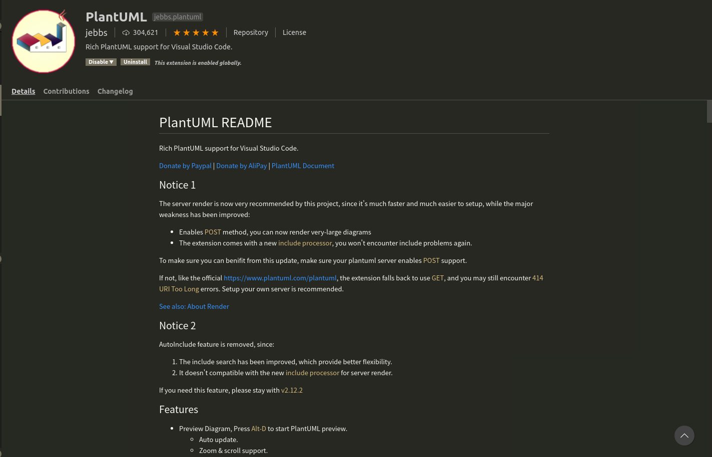
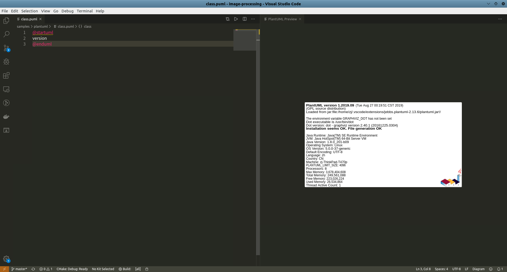

# VSCode插件使用

`VSCode`提供了`PlantUML`插件，在左侧菜单栏`->Extensions`中搜索`PlantUML`即可



安装完成后，即可在`VSCode`中编辑`.puml`文件

```
@startuml
version
@enduml
```

在编辑框中右键`Preview Current Diagram`，或者使用快捷键`Alt+D`即可完成预览

