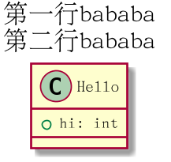

# 常用命令

参考：[通用命令](https://plantuml.com/zh/commons)

除了绘制各种`UML`图的命令外，常常需要一些额外操作，比如放大图形、添加标题等等

## 注释

单行注释使用单引号`'`

多行注释使用`/'`和`'/`作为注释的起始和结束

## 缩放图

使用`scale`命令缩放生存的`UML`图。示例如下：

```
@startuml
' 放大1.5倍
scale 1.5
' 指定宽度为200
scale 200 width
' 指定图像大小为200*100
scale 200*100
' 指定图像最大为300*200
scale max 300*200
@enduml
```

## 标题

使用`title`命令添加标题。示例如下：

```
@startuml
scale 300*200
title 第一行bababa\n第二行bababa

class Hello {
  + hi: int
}
@enduml
```



## 