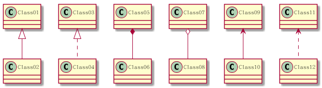
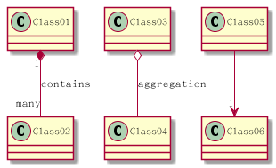
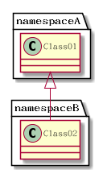
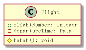
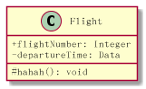
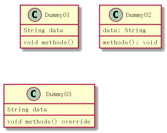
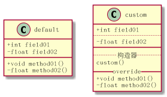

# 类图使用

学习[类图小结](../类图小结.md)，使用`PlantUML`绘制类图

## 类之间的关系

### 关系绘制

```
@startuml
' 泛化 空心三角形+实线
Class01 <|-- Class02
' 实现 空心三角形+虚线
Class03 <|.. Class04
' 组合 实心菱形+实线
Class05 *-- Class06
' 聚合 空心菱形+实线
Class07 o-- Class08
' 关联 箭头+实线
Class09 <-- Class10
' 依赖 箭头+虚线
Class11 <.. Class12
@enduml
```



### 关系上的标识

* 在关系之间使用标签来说明时,使用`:`后接标签文字
* 对两边元素的说明，可以在每一边使用`""`来说明

```
@startuml
Class01 "1" *-- "many" Class02 : contains

Class03 o-- Class04 : aggregation

Class05 --> "1" Class06
@enduml
```



## 命名空间

使用类的全限定名即可实现命名空间

```
@startuml
namespaceA.Class01 <|-- namespaceB.Class02
@enduml
```

类`Class01`位于命名空间`namespaceA`，类`Class02`位于命名空间`namespaceB`，实现如下：



## 字段/方法语法格式

### 可见性

分别使用加号、减号和井号表示公共、私有和受保护

```
@startuml
class Flight {
    +flightNumber: Integer
    -departureTime: Data
    
    # hahah(): void
}
@enduml
```



默认情况下将`+/-/#`转换成图标，如果只要显示符号，在前面添加`skinparam classAttributeIconSize 0`即可

```
@startuml
skinparam classAttributeIconSize 0
class Flight {
    +flightNumber: Integer
    -departureTime: Data
    
    # hahah(): void
}
@enduml
```



### 声明

`PlantUML`可以非常灵活的处理类内部的属性和函数绘制

* 方式一：正常的声明方式

```
@startuml
class Dummy {
    String data
    void methods()
}
@enduml
```

* 方法二：返回值类型放置在末尾

```
@startuml
class Dummy {
    data: String
    methods(): void
}
@enduml
```

当前更加推荐第一种方式的实现，同时对于一些特定语言的关键字（比如`C++`中的`virtual/override`等等），也可以加入进去

```
@startuml
class Dummy03 {
    String data
    void methods() override
}
@enduml
```



## 分隔线

`PlantUML`默认将方法和属性进行分组，使用实线分隔开。同时，PlantUML提供了自定义分隔符：`../--/==`

```
@startuml
class default {
    + int field01
    - float field02

    + void method01()
    - float method02()
}

class custom {
    + int field01
    ' 两格点号表示虚线
    ..
    - float field02
    ' 两格下划线表示实线
    __
    ' 可以在线段中间添加文字
    .. 构造器 ..
    custom()
    __ override __
    + void method01()
    - float method02()
}
@enduml
```

